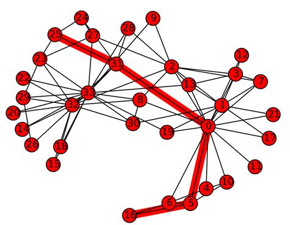
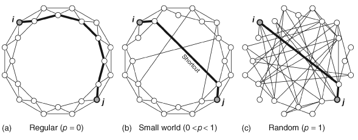
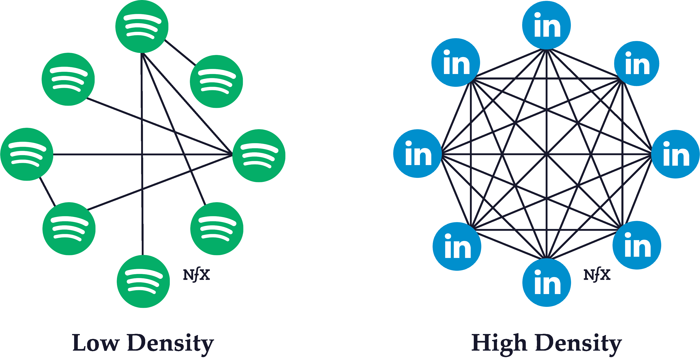

---
output:
  pdf_document: default
  html_document: default
---
# Chapter 6: Macro-level network measures {#ch6}

In this section, we will review network science measures that describe the overall or global structure of the entire network. You can think of these measures as providing a “bird’s eye view” of your network, and they are useful for comparing different network representations.

To facilitate the demonstrations below, we will use the undirected, unweighted karate network that we have previously seen in Chapter 4. In the rest of the chapter we will compute various macro-level network measures for this network. 

```{r}
#| echo: true
#| eval: true
karate_el <- read.csv('data/karate_el.csv', header = FALSE)

karate_uu <- graph_from_data_frame(karate_el, directed = FALSE)

summary(karate_uu)
```

Although it is possible to compute macro-level network measures for directed, weighted networks in certain instances (and this will be pointed out where appropriate), I choose to focus on the undirected, unweighted version for this chapter because macro-level measures are more complex to interpret and less intuitive when additional information like edge weights and direction are included. For instance, *network density* refers to the ratio of the number of (existing) edges and the number of possible edges among nodes in the network--it is not clear how this measure be adapted if we wanted to use weighted edges instead. 

## Average Degree 

A common method of characterizing the global structure of networks is to simply compute **average degree**, which is the mean of the degree of all nodes in the network. A node's degree refers to the number of connections or edges that are incident to the node. 

We first use `degree` to compute degree for each node (see Chapter 7: Degree) and then pipe the output to get the mean degree for the entire network.

```{r}
#| echo: true
#| eval: true

degree(karate_uu) |> mean()
```

On average, each node in the karate network has 4.5 connections. 

In Chapter 7 we will learn that it is possible to compute different variants of degree for directed graphs. In-degree refers to the number of edges incoming to the target node, out-degree refers to the number of edges outgoing from to the target node, and all-degree refers to all the edges (the sum of in- and out-degree). Try running the code below on a network with directed edges. 

```{r}
#| echo: true
#| eval: false

# mean in-degree
degree(karate_uu, mode = 'in') |> mean()

# mean out-degree
degree(karate_uu, mode = 'out') |> mean()

# mean all-degree
degree(karate_uu, mode = 'all') |> mean()
```

## Average Shortest Path Length

**Average shortest path length** (ASPL) refers to the mean of the shortest possible path between all possible pairs of nodes in the network. (This loosely corresponds to the idea of "six degrees of separation" in social networks.)

The figure below depicts the shortest path between nodes 25 and 16 (path length = 4).



To compute the ASPL of the karate network: 

```{r}
#| echo: true
#| eval: true

mean_distance(graph = karate_uu)
```

On average, it takes 2.4 steps to connect any two randomly selected nodes in the karate network. 

It is possible to compute ASPL based on shortest paths that consider the direction and weights of the edges. 

```{r}
#| echo: true
#| eval: true
mean_distance(karate_uu, weights = NA, directed = F) # unweighted, undirected

mean_distance(karate_uu, weights = NA, directed = T) # unweighted, directed 

mean_distance(karate_uu, directed = F) # weighted, undirected

mean_distance(karate_uu, directed = T) # weighted, directed 
```

Because `karate_uu` is undirected and unweighted, the result is unsurprisingly identical across all 4 version (try this with a directed, weighted network!). When a graph contains edge weights, then they are automatically considered unless you instruct otherwise using `weights = NA`. Use the `directed` argument to specify if the direction of the edges should be considered in the computation of short paths. 

An important point to note is that edge weights are interpreted as *distances* rather than *strength of connection*: See Chapter 7 for more information about this. 

## Global Clustering Coefficient

**Global clustering coefficient**, or global *C*, refers to the number of closed triangles in the network relative to the number of possible triangles. It is a measure of overall level of local connectivity among nodes in the network.

A simple way of thinking about this concept is that it is measuring the probability that each pair of "friends" of a given node are also friends with each other.

To computer global clustering coefficient, we use the `transitivity` function as follows: 

```{r}
#| echo: true
#| eval: true

transitivity(karate_uu, type = 'global')
```

We can interpret this value to mean that for each pair of nodes that are directly connected to a target node, the probability that these two nodes are also connected to each other is 25.6% (i.e., the probability of a completed "triangle", when it is possible, is 25.6%). This value is usually quite high in social networks, because people tend to introduce their friends to each other, resulting in *triadic closure*.

Contrast this with Chapter 7: Local clustering coefficient--notice that although we use the same function, the `type` argument specifies if we want to obtain the global clustering coefficient for the whole network (overall local connectivity), or local clustering coefficient for individual nodes (local connectivity centered on a single node).

## Small World Index

The term "small world" has a specific meaning in network science as compared to the layperson's. A network is considered to have small world characteristics if (i) its ASPL is shorter than that of a randomly generated network with the same number of nodes and edges, and (ii) its global *C* is larger than that of a randomly generated network with the same number of nodes and edges. There are various ways to compute a value that quantifies the "small worldness" of a network, although we do not cover all of them here (see Neal, 2017, for a comparison of different methods). In this section we go through an approach to quantifying small-worldness based on Humphries and Gurney (2008).

In practice, researchers compute a measure known as the **small world index** which combines the global clustering coefficient and ASPL of the target network relative to its equally sized random graphs (with the same number of nodes and edges) to derive a proportional score. 

Mathematically,
$$SWI = \frac{C_i / \overline C_{rand}}{L_i / \overline L_{rand}}$$
where *C* = global clustering coefficient, *L* = average shortest path length, *i* = network of interest, *rand* = random network, $\overline x$ denotes mean of the random networks' measures.

In order to compute the Small World Index we need to first generate networks that form a baseline for comparison to the target network (see also Chapter 9: Network Models). Here, we generate 5 size-matched Erdos-Renyi (ER) networks, which is a type of random network model where edges are distributed randomly across a set of nodes. We specify that the number of nodes and edges of the ER network to be identical to the target network (`karate_uu`). Then we take the mean ASPL and C of the ER networks, which becomes the $\overline L_{rand}$ and $\overline C_{rand}$ in the equation above respectively. 

```{r}
#| echo: true
#| eval: true

## generate ER networks 
set.seed(2)

er_graphs <- list()

for(i in 1:5) { # number of networks to generate
  er_graphs[[i]] <- sample_gnm(n = gorder(karate_uu), m = gsize(karate_uu), directed = F, loops = F)
}

# compute the L and C for each ER network, take the mean 
sapply(er_graphs, mean_distance) |> mean() # L_rand
sapply(er_graphs, transitivity, type = 'global') |> mean() # C_rand
```

We can now plug in these values together with the actual C and L of the target network to compute SWI: 

```{r}
#| echo: true
#| eval: true

# SWI for karate_uu 
(0.2556818/0.1188022)/(2.4082/2.384314)
```

Humphries and Gurney (2008) write that SWI larger than 1 indicates presence of a small world structure, since this implies that the target network has more local clustering than random expectation, while having relatively similar ASPLs. SWIs less than 1 or close to 1 indicates that there is no evidence to support the claim that the target network is a small world. Here, we have some evidence supporting the claim that our karate network has a small world structure. In practice, up to 1,000 random ER networks are generated to compute $\overline L_{rand}$ and $\overline C_{rand}$; although this can be a slow process depending on your network size. The number of random networks to generate can be adjusted in the for loop above. 

The main take home message is that a small world network has high levels of local clustering (nodes whose neighbors are also neighbors of each other), but also contains a number of shortcuts that drastically reduces the overall distances/path lengths between nodes. See below for an illustration of this idea.



## Network Density

**Network density** refers to the ratio of the number of (existing) edges and the number of possible edges among nodes in the network.

Simple example of networks with lower and higher network densities.



To obtain network density of a network:

```{r}
#| echo: true
#| eval: true

edge_density(karate_uu)
```

This means that 13.9% of all possible edges in the network are actual edges. 

## Network Diameter

Network diameter refers to length of the longest shortest path between nodes in the network. Instead of getting the mean of all the shortest paths as you did in ASPL, what is the maximum length of those short paths?

Simple example of networks with higher and lower network diameters


To obtain network diameter of a network:

```{r}
#| echo: true
#| eval: true

diameter(karate_uu, directed = F)

# diameter(karate_uu, directed = T) # directed edges 
```

This means that the length of the longest shortest path between two nodes in the network is 5.

## Assortative Mixing 

**Assortative mixing** is a measure of *homophily* in the network, based on some internal/external property of the nodes. Are nodes that are connected to each other tend to have similar properties?

### Assortative Mixing by Degree (continuous attributes)

A common extension of assortative mixing is **assortative mixing by degree**, which measures the correlation of degrees between neighboring nodes. Are nodes that are connected to each other tend to have similar degrees?

A positive value indicates that nodes that are many (few) neighbors tend to be connected to nodes that also have many (few) neighbors. A negative value indicates that nodes that are many (few) neighbors tend to be connected to nodes that have few (many) neighbors. Values very close to zero indicates no correlation.

```{r}
#| echo: true
#| eval: true

assortativity_degree(karate_uu, directed = F)

# assortativity_degree(karate_uu, directed = T) # for directed edges 
```

There is *dissortativity mixing by degree* in the karate network--nodes with higher degree have a higher tendency to be connected to nodes with lower degree. 

It is possible to add your own node attributes to the network (see Chapter 5) and compute its assortativity. The script below demonstrates this with a randomly created set of numbers for the nodes (i.e., a continuous variable ranging from 1 to 5, randomly selected with replacement for each of the 34 nodes in the network). Because these numbers are randomly generated, we expect assortativity to be close to 0 here.

```{r}
#| echo: true
#| eval: true

# create a random vector of numbers for demonstration
set.seed(3)
V(karate_uu)$random1 <- sample(1:5, gorder(karate_uu), replace = T)

# compute the assortativity of this node attribute 
assortativity(karate_uu, values = V(karate_uu)$random1, directed = F)
```

### Assortative Mixing by Node Attributes (categorical attributes)

It is also possible to compute assortativity for categorical labels assigned to nodes. For instance, in a social network of male and female actors, is there gender homophily such that nodes tend to be connected to other nodes that share the same label? 

A positive value indicates that nodes with the same labels tend to be connected to each other. A negative value indicates that nodes tend to be connected to nodes with a different label from itself. Values very close to zero indicates no correlation.

It is possible to add your own node attributes to the network (see Chapter 5) and compute its assortativity. The script below demonstrates this with a randomly created set of labels for the nodes (i.e., a categorical variable). Because these labels are randomly generated, we expect assortativity to be close to 0 here.

```{r}
#| echo: true
#| eval: true

# create a random vector of labels for demonstration
set.seed(3)
V(karate_uu)$random2 <- sample(c('A', 'B', 'C'), gorder(karate_uu), replace = T)

# compute the assortativity of this node attribute 
assortativity_nominal(karate_uu, types = factor(V(karate_uu)$random2), directed = F)
```

## Network Components 

Thus far, we have been assuming that the networks that we have worked with form a single component. In other words, all nodes are part of the same component, and there are no separate components. But, as shown in the example network below, it is certainly possible for nodes in a network to fragment into distinct components.

```{r}
#| echo: true
#| eval: true

# create a sample network with two distinct components 
g <- graph_from_literal(A-B, B-C, A-C, D-E)
plot(g)
```

When working with networks derived from behavioral data, it can be common to observe that the network consists of distinct network components. This has implications for the computing and interpretation of the macro-level network measures, because several of them rely on the computation of shortest path between node pairs. For instance, ASPL computes the shortest paths for all possible node pairs and takes the mean--but what happens if there is no path between nodes A and D, for example? 

Node pairs that do not have a path are ignored in the computation. This is the default behavior in `igraph`. Hence, this value reflects the mean of all "computable" short paths (i.e., when node pairs are found in the same component) and this is computed across all network components in the network.

```{r}
#| echo: true
#| eval: true

mean_distance(g, unconnected = TRUE) # ignore infinite paths, default 

mean_distance(g, unconnected = FALSE) # consider infinite paths 
```

As you can see, the second output is `Inf`, reflecting the presence of infinite paths in the network. From the `igraph` documentation: "If TRUE, only the lengths of the existing paths are considered and averaged; if FALSE, the length of the missing paths are considered as having infinite length, making the mean distance infinite as well."

Hence, it is good practice to first check if your network consists of a single component, or multiple components. We can use the following script to find out: how many components, the size of each components (number of nodes), and obtain a list of nodes and their component membership. Basically, `components` is a special function that stores these pieces of information as its output, which you can then retrieve using the `$`: `csize` for size of component, `no` for number of components, `membership` for the component membership for each node.

```{r}
#| echo: true
#| eval: true

g_comp <- components(g)

g_comp$csize # size of each component 
g_comp$no # number of components 

data.frame(node = V(g)$name, membership = g_comp$membership)
# you should know how to export the results into a .csv file! 
```

Typically, real-world networks have a giant or largest connected component (LCC) which contains the majority of nodes in the network, and researchers prefer to only compute network-level metrics on the LCC. This component is extracted for further analysis, removing the smaller connected components or hermits (isolates in the network where the node has no neighbors). 

The code below shows you how to extract the largest connected component of the sample network: 

```{r}
#| echo: true
#| eval: true

g_lcc <- induced_subgraph(graph = g, 
                          vids = components(g)$membership == which.max(components(g)$csize)) 

summary(g_lcc)
```

It is also possible to extract other components of the network. The code below retains nodes that do not belong to the largest connected component of the network. 

```{r}
#| echo: true
#| eval: true

g_2 <- induced_subgraph(graph = g, 
                          vids = components(g)$membership != which.max(components(g)$csize)) 

summary(g_2)
```

## Exercise 

Your task is to:

1. Load the `UKfaculty` network from the `igraphdata` library using the following code: 

```{r}
#| echo: true
#| eval: false

library(igraphdata) # have you downloaded the package? 

data("UKfaculty") # you should see a UKfaculty object appear in your Environment

# I've included this code to make it an undirected, unweighted network for this exercise
# for more information about network manipulation, see Chapter 5
UKfaculty <- UKfaculty |> delete_edge_attr("weight") |> as.undirected(mode = 'mutual')
```

{TODO: Briefly describe the network.}

2. Answer the following questions:

- How many nodes and edges does the network have?

- How many network components does this network have? If it has more than one component, only retain the largest connected component before proceeding to the next part. 

- Compute the following macro-level network measures for this network:
    - average degree
    - average shortest path length 
    - global clustering coefficient
    - network density
    - network diameter 
    - assortativity (by degree and by group) {footnote}
    - small world index

Footnote: `UKfaculty` contains a `Group` node attribute which denotes the department that each faculty member belonged to. 
