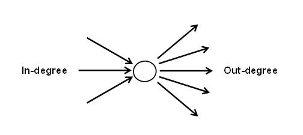
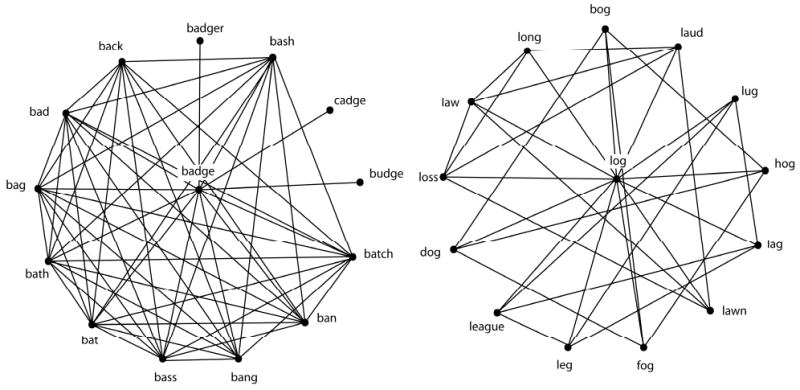

---
output:
  pdf_document: default
  html_document: default
---
# Chapter 7: Micro-level network measures {#ch7}

Micro-level network measures provide you with information about specific nodes in the network. These are generally known as centrality measures in the network science literature. Centrality is the network scientist’s way of quantifying the relative "importance" of a given node relative to other nodes in the network. There are *many* different definitions of what counts as "central", as you will see in the following subsections, and also from this [Periodic Table of Centrality Indices](http://schochastics.net/sna/periodic.html). There is no single "correct" or "best" metric - which metrics are most useful to you will depend on the nature of the system that you are modeling as well as the network behavior that you interested in.

To facilitate the demonstrations below, we will use the directed, weighted karate network that we have previously seen in Chapter 4. In the rest of the chapter we will compute various micro-level network measures for the nodes in this network. 

```{r}
#| echo: true
#| eval: true
karate_el <- read.csv('data/karate_el_weights.csv', header = TRUE)

karate_dw <- graph_from_data_frame(karate_el, directed = TRUE)

summary(karate_dw)
```

## Degree 

The **degree** of node *i*, frequently denoted as *k_i* in the network science literature, refers to the number of edges or links directly connected to node *i*.

To get the degree of all nodes in the network, try running the following code:

```{r}
#| echo: true
#| eval: true
degree(graph = karate_dw)
```

If you only want the degree for a specific node: 

```{r}
#| echo: true
#| eval: true
degree(graph = karate_dw, v = 'Mr Hi')

degree(graph = karate_dw, v = c('Mr Hi', 'Actor 5')) # for more than 1 node
```

It would be better to "save" the outputs as an object (especially if your network is very large!) so that you can manipulate or export it later. 

```{r}
#| echo: true
#| eval: true
karate_degree <- degree(karate_dw)
```

Notice that you have a named vector called `karate_degree` in your Environment. 

### In-, out-, all-degree

If your network has directed edges, **in-degree** refers to the number of edges that are going towards the target node, whereas **out-degree** refers to the number of edges that are going away from the target node. **all-degree** is the sum of in-degree and out-degree, and is the same as *degree*.



To get the in- or out-degree of a node, we need to include the `mode = 'in'` or `mode = 'out'` argument accordingly. 

```{r}
#| echo: true
#| eval: true
degree(graph = karate_dw, v = 'Actor 5', mode = 'in') # in-degree = incoming edges

degree(graph = karate_dw, v = 'Actor 5', mode = 'out') # out-degree = outgoing edges
```

Notice that Actor 5 has an in-degree of 1 and out-degree of 2, and in the previous section we saw that Actor 5 had a degree of 3. If no arguments are specified, `igraph` will compute all-degree, which is the sum of a node's in- and out-degree, by default for directed graphs. Keep this in mind! 

```{r}
#| echo: true
#| eval: true
degree(graph = karate_dw, v = 'Actor 5') # the default is all-degree

degree(graph = karate_dw, v = 'Actor 5', mode = 'all') 

degree(graph = karate_dw, v = 'Actor 5', mode = 'total') # all is the same as total
```

## Strength 

The **strength** of node *i* refers to the sum of its adjacent edge weights. This measure is only applicable to weighted networks. 

To get the strength of all nodes in the network, try running the following code:

```{r}
#| echo: true
#| eval: true
strength(graph = karate_dw)
```

If you only want the strength for a specific node(s): 

```{r}
#| echo: true
#| eval: true
strength(graph = karate_dw, v = 'Mr Hi')

strength(graph = karate_dw, v = c('Mr Hi', 'Actor 5')) # for more than 1 node
```

### In-, out-, all-strength

If your network has directed edges, we can have variations to the original strength measure just as we saw for degree. **In-strength** refers to the sum of the edge weights that are going towards the target node, whereas **out-strength** refers to the sum of the edge weights that are going away from the target node. **all-strength** is the sum of in-strength and out-strength, and is the same as *strength*.

To get the in- or out-strength of a node, we need to include the `mode = 'in'` or `mode = 'out'` argument accordingly. 

```{r}
#| echo: true
#| eval: true
strength(graph = karate_dw, v = 'Actor 5', mode = 'in') # in-degree = incoming edges

strength(graph = karate_dw, v = 'Actor 5', mode = 'out') # out-degree = outgoing edges
```

It is worth noting here that the in-strength and out-strength of Actor 5 is the same, but recall from the degree section that the in-degree and out-degree of Actor 5 differed. This is a key point to remember, is that strength does *not* provide you with information about the *number* of edges the node has - it is possible for a node to have high strength due to a few highly weighted edges or several weakly weighted edges. 

Once again, if no arguments are specified, `igraph` will compute all-strength, which is the sum of a node's in- and out-strength, by default for directed graphs.

```{r}
#| echo: true
#| eval: true
strength(graph = karate_dw, v = 'Actor 5') # the default is all-strength

strength(graph = karate_dw, v = 'Actor 5', mode = 'all') 

strength(graph = karate_dw, v = 'Actor 5', mode = 'total') # all is the same as total
```

## Local clustering coefficient 

The **local clustering coefficient**, *C*, of node *i* measures the ratio of the actual number of edges existing among nodes directly connected to the target node *i* to the number of all possible edges that could exist among these nodes.

*C* ranges from 0 to 1. When $C = 0$, none of the neighbors of the target node are connected to each other. When $C = 1$, each neighbor of the target node is connected to all the other neighbors of the target word.

You can think of local clustering coefficient as providing a measure of the *level of interconnectivity among the local neighborhood of the target node*. If you look at the figure below, you can easily see that it is possible for nodes to have the same degree, but different local clustering coefficients.


To get the local clustering coefficient of all nodes in the network, try running the following code:

```{r}
#| echo: true
#| eval: true

transitivity(karate_dw, type = 'local', isolates = 'zero')
```

A couple of things to note:

1. It is important to specify `type = local` for local clustering coefficients (one value for each node), as compared to the global clustering coefficient of the entire graph (this is a macro-level measure that we learned about in Chapter 6).

2. For nodes that have a degree of 0 or 1, it would not be possible to compute a local clustering coefficient value for those nodes. Be default `igraph` will return a `NaN` value (see Actor 12's value below). By specifying `isolates = 'zero'` these `NaN` values will be reported as zeros instead. 

```{r}
#| echo: true
#| eval: true

transitivity(karate_dw, type = 'local')
```

### Weighted local clustering coefficient

If you have a weighted network, you can compute *weighted* local clustering coefficients using Barrat et al.’s (2004) generalization of transitivity to weighted networks by specifying `type = 'weighted'`. If your network is unweighted, this generalization will simply return unweighted C values.

```{r}
#| echo: true
#| eval: true

transitivity(karate_dw, type = 'weighted')
```

## Closeness centrality 

**Closeness centrality** of node *i* is the inverse of the average of the length of the shortest path between node *i* and all other nodes in the network. If a node has high closeness centrality, it means that on average, it takes few steps to travel from that node to all other nodes in the network. If a node has low closeness centrality, it means that on average, it takes more steps to travel from that node to all other nodes in the network.

Closeness centrality is commonly viewed as an indicator of the accessibility of a given node in the network from all other locations in the network.

To get the closeness centrality of all nodes in the network, try running the following code:

```{r}
#| echo: true
#| eval: true

closeness(karate_dw, normalized = T) # weights are automatically considered
```

It is typical to include `normalized = T` so that the values are normalized with respect to the size of the network. 

Note that closeness centrality can only be meaningfully computed for connected graphs (so that a path exists between any pair of nodes; see Chapter 6: Network Components). If there are distinct network components in the network, this means that for some sets of node pairs, the path between them does not exist and closeness cannot be computed. Usually, network scientists focus their analysis on the largest connected component of the network and ignore the smaller connected components (which are typically viewed as outliers). Chapter 6 provides you with the code needed to extract the largest connected component from the initial network. 

You can specify the `mode` and `weights` arguments accordingly if you have directed/weighted networks to get the corresponding versions of closeness centrality computed. 

### Weighted closeness centrality 

If your network is weighted, weights are automatically included in the computation of closeness centrality. If you prefer that edge weights are *not* considered, include `weights = NA` in the argument. Notice that some of the values have changed depending on whether weights are considered or not. 

If your network is unweighted, then weights are not considered by default. 

```{r}
#| echo: true
#| eval: true

closeness(karate_dw, normalized = T) # weights are automatically considered

closeness(karate_dw, normalized = T, weights = NA) # weights are ignored
```

### Interpretation of edge weights

Caution is needed as the interpretation of edge weights in this context is to treat them as *distances* rather than as connection strengths. In other words, when computing closeness centralities, `igraph` treats higher edge weights as longer distances. As reproduced from the `igraph` documentation: "If the graph has a weight edge attribute, then this is used by default. Weights are used for calculating weighted shortest paths, so they are interpreted as distances."). 

Notice that this is different from how we would normally want to interpret edge weights, usually as indicator of the strength of the relation between two nodes. If we want the weights to be interpreted in the way that we intend (as relational strength) we need to include the following to "trick" igraph: `weights = 1/E(network)$weight`. This inverts the relation so that now bigger numbers for edge weight corresponds to shorter distances (and hence shorter paths).

To demonstrate this point consider the simple example below where we wish to compute the shortest path between two nodes in unweighted and weighted networks. Notice that the result changes depending on the weights assigned to the edges--whereby smaller weights are considered to provide "shorter paths" between pairs of nodes. This corresponds to the "distance" interpretation of edge weights. Because closeness centrality relies on the same `shortest_paths` function under the hood, this is something that we need to keep in mind when deciding to computed weighted closeness centrality. 

```{r}
#| echo: true
#| eval: true

# unweighted graph
g <- graph_from_literal(A-B,B-C,A-D,D-E,E-C) 

# weighted graph 
g_w <- g
E(g_w)$weight <- c(2,1,2,1,1) 

plot(g_w, edge.width = E(g_w)$weight*2)

# what is the shortest path between nodes A and C?
shortest_paths(g_w, from = "A", to = "C")$vpath # the shortest path is not A-B-C! 

shortest_paths(g, from = "A", to = "C")$vpath # the shortest path is A-B-C! 

# the reason is between bigger weights correspond to larger distances.
# and hence longer paths 

# the shortest path is A-B-C after we invert the edge weights
E(g_w)$weight <- 1/c(2,1,2,1,1)
shortest_paths(g_w, from = "A", to = "C")$vpath 
```

### Directed closeness centrality 

As shown in the example below for *John A*, different closeness centrality values are returned depending on whether closeness centrality should be computed based on both incoming and outgoing edges (`mode = 'all'`), incoming edges only (`mode = 'in'`), or outgoing edges only (`mode = 'out'`). Because *John A* has an out-degree of 0 (see if you know how to verify this for yourself!), it has a closeness centrality of NaN when `mode = 'out'` is specified. 

```{r}
#| echo: true
#| eval: true
closeness(karate_dw, normalized = T, weights = NA, mode = 'all', vids = 'John A')

closeness(karate_dw, normalized = T, weights = NA, mode = 'in', vids = 'John A')

closeness(karate_dw, normalized = T, weights = NA, mode = 'out', vids = 'John A')
```

## Betweenness centrality 

**Betweenness centrality** is a measure of the degree to which nodes stand in between each other. A node with a high betweenness centrality is a node that is frequently found in the short paths of other pairs of nodes in the network. In contrast, a node with a low betweenness centrality is a node that is not usually found in the short paths of node pairs. Betweeenness can be viewed as an indicator of whether a node represents a "bottleneck" in the system.

The same considerations (i.e., about connected graphs, additional arguments for weighted and directed graphs, normalization, interpretation of weights as distances) from the closeness centrality section applies to betweenness centrality as well, because betweenness centrality also relies on the `shortest_paths` function for its computation. 

To get the betweenness centrality of all nodes in the network, try running the following code:

```{r}
#| echo: true
#| eval: true

igraph::betweenness(karate_dw, normalized = T) # weights are automatically considered
```

### Weighted betweenness centrality

If your network is weighted, weights are automatically included in the computation of betweenness centrality. If you prefer that edge weights are *not* considered, include `weights = NA` in the argument. Notice that some of the values have changed depending on whether weights are considered or not. 

If your network is unweighted, then weights are not considered by default. 

```{r}
#| echo: true
#| eval: true

igraph::betweenness(karate_dw, normalized = T) # weights are automatically considered

igraph::betweenness(karate_dw, normalized = T, weights = NA) # weights are ignored
```

### Directed betweenness centrality

As shown in the example below for *John A*, different betweenness centrality values are returned depending on whether betweenness centrality should be computed by considering the directionality of the edges (`directed = TRUE`), or if edge direction should be ignored (`directed = FALSE`). Basically, if `directed = TRUE`, the shortest paths are only possible between node pairs where the edge directions are aligned (i.e., A->B->C), but if `directed = FALSE` then shortest paths are possible as long as there is an existing edge and direction of the edges is ignored. 

```{r}
#| echo: true
#| eval: true
igraph::betweenness(karate_dw, normalized = T, weights = NA, directed = TRUE, v = 'John A')

igraph::betweenness(karate_dw, normalized = T, weights = NA, directed = FALSE, v = 'John A')
```

Quick note: I've included `igraph::betweenness` to tell R to use the `betweenness` function from the `igraph` library and not the one from `influenceR` library (Chapter 12). This is important because sometimes different libraries have functions with the same name. 

## Page Rank centrality 

**Page Rank centrality** is a centrality measure developed by Google to rank webpages (the historic paper describing the algorithm can be viewed [here](http://infolab.stanford.edu/~backrub/google.html)). The general idea is that a random walker will traverse the network space and their paths are biased by the link connectivity structure of the network. The random walker restarts the walk after some time (simulating "boredom" of the surfer). The number of visits received by a node provides an indicator of its importance in the network. Intuitively, we expect that nodes have a high Page Rank score if there are many nodes that point to it, or if the nodes that point to it themselves have a high Page Rank score.

The `weights` and `directed` arguments can be adjusted depending on your graph type. It is important to note that the interpretation of edge weights here is that of "connection strength" (Reproduced from the `igraph` manual: "This function interprets edge weights as connection strengths. In the random surfer model, an edge with a larger weight is more likely to be selected by the surfer."). This is different from the "distance" interpretation of edge weights in the closeness and betweenness centralities sections.

To get the Page Rank centrality of all nodes in the network, try running the following code:

```{r}
#| echo: true
#| eval: true

# undirected, unweighted centralities 
page_rank(graph = karate_dw, directed = F, weights = NA)$vector

# directed, weighted centralities (weights used by default)
page_rank(graph = karate_dw, directed = T)$vector

# notice we include the "$vector" after the function because the function outputs
# a list object, and we only want the part of the object that contains the 
# centrality values for the individual nodes 
```

## Other forms of node centrality

`igraph` is also able to compute the following node centrality scores: 

- [authority score](https://igraph.org/r/doc/authority_score.html) 
- [eigenvector centrality](https://igraph.org/r/doc/eigen_centrality.html); directed generalization is [alpha centrality](https://igraph.org/r/doc/alpha_centrality.html)
- [harmonic centrality](https://igraph.org/r/doc/harmonic_centrality.html) 
- [hub centrality](https://igraph.org/r/doc/hub_score.html) 
- [power centrality](https://igraph.org/r/doc/power_centrality.html) 

If you interested to learn about these the links to the `igraph` documentation are included above. {May be further discussed in later versions of the book.}

## Exporting node centrality measures for data analysis 

As you can see from this chapter, it is fairly straightforward to obtain node centrality measures--you need to know which functions to use, and think about whether you want a variant of the measure that reflects properties of the network that are important for your research (e.g., directedness and weightedness of the edges). However, printing out the values in the Console is unwieldy, and makes it quite difficult to manipulate and analyze this information. 

Below is a code chunk that you should be able to easily edit to extract the measures that you want for all nodes in a given network. It creates a data frame containing each centrality measure in a separate column and node names in another column. You can add more or fewer centrality measures in the data frame. Then you analyze the data frame object as per normal (e.g., are degree and local clustering coefficient of nodes positively correlated in this network?) or export the data frame so that you can merge it with other measures (e.g., gender of each person) and conduct statistical tests in another software (e.g., on average, do males have a higher closeness centrality than females?).

```{r}
#| echo: true
#| eval: false 
node_centrality_data <- data.frame(
    degree = degree(karate_dw, mode = 'all'), # column_name = centrality function 
    out_strength = strength(karate_dw, mode = 'out'),
    uu_closeness = closeness(karate_dw, normalized = TRUE, mode = 'all', weights = NA)
    )

write.csv(node_centrality_data, file = 'results.csv')
```

## Exercise 

Your task is to:

1. Load the famous [Krackhardt's Kite](https://en.wikipedia.org/wiki/Krackhardt_kite_graph) network from the `igraphdata` library using the following code: 

```{r}
#| echo: true
#| eval: false

library(igraphdata) # have you downloaded the package? 

data("kite") # you should see a kite object appear in your Environment
```

2. Answer the following questions:

- How many nodes and edges does the network have?

- What type of edges does the network have? 
    
- Find out which node(s) has:
    - the highest/lowest degree in the network?
    - the highest/lowest local clustering coefficient?
    - the highest/lowest betweenness centrality?
    - the highest/lowest closeness centrality?
    - the highest/lowest Page Rank centrality? 

3. Save the node-level measures as a `.csv` file and open it in a spreadsheet program of your choice.

4. Do the same nodes have the highest degree, closeness, and betweenness centrality scores in this network? Try plotting the network and explain why different nodes have the highest scores on these centrality measures. 
